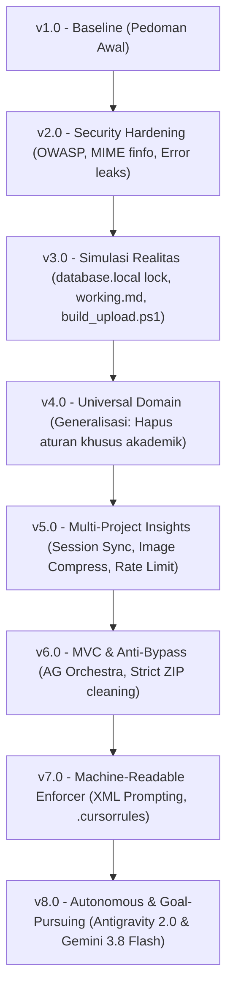

# Panduan Penyusunan Model Kerja Agen AI (Autonomous & Strict Compliance)
*Sebuah Blueprint Pembelajaran & Rujukan Praktis Pengembangan AI-Assisted Software Engineering*

---

## 1. Pendahuluan: Mengapa Model Kerja Dibutuhkan?

Saat berkolaborasi dengan *Large Language Models* (LLM) seperti Claude, Gemini, atau model via OpenRouter, pengembang sering menghadapi beberapa kendala berulang:
1. **Kehilangan Konteks (Context Drift)**: Saat kuota habis, sesi di-restart, atau berganti model AI, agen melupakan tugas sebelumnya dan merusak alur yang sudah ada.
2. **Halusinasi & Asumsi Liar**: AI mengubah file konfigurasi lokal (`database.local.php`), menghapus tabel, atau menulis kode yang tidak sesuai standar keamanan.
3. **Regresi (Breaking Existing Code)**: AI memperbaiki satu bug kecil, tetapi mematahkan tiga fungsi utama lainnya yang sebelumnya sudah berjalan normal.
4. **Artefak Sampah Terunggah**: File percakapan, draf, dump SQL, dan kredensial ikut terkompresi ke dalam ZIP yang diunggah ke server produksi.

**Model Kerja (Working Model)** adalah sistem tata kelola (*governance framework*) yang mengubah agen AI dari sekadar "chatbot penjawab prompt" menjadi **insinyur perangkat lunak otonom yang berdisiplin tinggi, patuh aturan, dan berorientasi pada penyelesaian sasaran (*Goal-Pursuing*)**.

---

## 2. Peta Evolusi Model Kerja (v1.0 hingga v8.0)

Penyusunan model kerja ini tidak terjadi dalam satu malam, melainkan melalui proses audit, uji coba nyata pada berbagai proyek (*spmi_pemetaan_app*, *simulasi_al*, *SIMPEL*, *saham/Stocks*), dan penyempurnaan berulang:



---

## 3. Komponen Inti Arsitektur Model Kerja

Setiap proyek yang menerapkan model kerja ini memiliki 6 instrumen fundamental:

| Instrumen | Lokasi | Peran & Tanggung Jawab |
|---|---|---|
| **Otak Aturan** | `.agents/AGENTS.md` | Memuat *runtime specification*, 6 pilar kualitas, batasan mutlak, dan prosedur coding. |
| **Pemicu Kepatuhan** | `.cursorrules` | *Enforcer* berbasis XML yang memaksa semua model membaca aturan sebelum menulis kode. |
| **Memori Eksternal** | `working.md` | Menjaga kontinuitas status pekerjaan antar sesi/alih akun (`<current_status>`, `<in_progress>`). |
| **Ledger Skema** | `migrations/MIGRATION_LOG.md` | Satu-satunya sumber kebenaran perubahan database (anti-perubahan diam-diam). |
| **Pembersih Rilis** | `build_upload.ps1` | Script otomasi pengemas ZIP produksi yang membuang artefak AI, backup, dan file sensitif. |
| **Pengawas Mesin** | `~/.gemini/config/rules/` | Aturan global di level OS yang memastikan proyek baru/lama otomatis ditawari instalasi model kerja. |

---

## 4. Langkah Demi Langkah Menyusun Model Kerja Mandiri

Bagi Anda yang ingin merancang model kerja untuk tim atau proyek pribadi, ikuti 7 langkah terstruktur berikut:

### Langkah 1: Tentukan 6 Pilar Kualitas Sistem Anda
Jangan biarkan AI berasumsi tentang standar kualitas. Nyatakan secara eksplisit:
- **Aman (Secure)**: OWASP Top 10, validasi MIME sesungguhnya via `finfo_file()`, larangan mengekspos exception PDO ke publik, dan *session hardening*.
- **Responsif (Responsive)**: Standar mobile-first, sentuhan minimal 48px, dan kontainer tabel fleksibel.
- **Dinamis (Dynamic)**: Penggunaan Fetch API/AJAX dengan indikator visual *Loading*, *Empty State*, dan notifikasi *Toast*.
- **Modern (Modern UI/UX)**: Tipografi standar (Inter/Roboto), kontras warna tinggi, dan kerapian visual.
- **Bersih (Clean MVC)**: Pemisahan peran Controller, Service/Model, dan View.
- **Mobile-Ready**: Pemisahan endpoint API `/api/v1/`, format JSON seragam, dan kesiapan integrasi mobile.

### Langkah 2: Definisikan Batasan Otonomi (Stop & Ask vs. Autonomous Execution)
AI membutuhkan kepastian kapan ia boleh langsung bergerak dan kapan ia harus meminta izin:
- **Boleh Otonom**: Memperbaiki bug sintaks, refactoring internal, menjalankan `php -l`, mengecek database lokal, dan mengupdate dokumentasi progress.
- **Wajib Stop & Ask**: Perubahan skema database produksi (`DROP`, `TRUNCATE`), perubahan logika bisnis sentral (*breaking changes*), dan pembuatan fitur skala besar (wajib melalui `implementation_plan.md`).

### Langkah 3: Terapkan Prinsip "Anti-Regression" (Nol Kerusakan Fitur Lama)
Salah satu kegagalan terbesar koding AI adalah merusak fitur yang sudah ada. Tuliskan larangan eksplisit pada dokumen aturan:
> *"Dilarang keras mengubah atau merusak kode/alur yang sudah berfungsi stabil hanya demi mengakomodasi fitur baru."*

### Langkah 4: Bangun Sistem Memori Eksternal (`working.md`)
Konteks chat AI bersifat fana (*ephemeral*). Gunakan tag XML yang terstruktur untuk menyimpan status:
```markdown
<context_memory>
<current_status>Fase dan fokus pekerjaan saat ini</current_status>
<completed_tasks>- [x] Tugas selesai</completed_tasks>
<in_progress>- [/] Tugas yang sedang dikerjakan (LANJUTKAN DARI SINI)</in_progress>
<backlog>- [ ] Rencana berikutnya</backlog>
</context_memory>
```

### Langkah 5: Lindungi File Kritis Lingkungan (Zero Overwrite)
Kerap kali AI menimpa konfigurasi server. Pisahkan arsitektur konfigurasi menjadi:
- `config/database.php`: Loader statis yang tidak boleh diubah oleh AI.
- `config/database.local.php`: Kredensial lokal pengembang (masuk `.gitignore`).
- `config/database.production.php`: Kredensial server live (hanya di server, tidak di repo).

### Langkah 6: Otomatisasi Pembersihan Paket Rilis Live
Jangan mengandalkan pembersihan manual sebelum upload ke shared hosting/VPS. Buat script regex (seperti `build_upload.ps1`) yang otomatis menyingkirkan:
- Berkas percakapan & instruksi AI (`working.md`, `task.md`, `.cursorrules`, dll.).
- Berkas backup manual (`*.old`, `*.bak`, `index.php.old`).
- Berkas database dump (`*.sql`) dan data sampel internal (`*.csv`).

### Langkah 7: Pasang "Global Enforcer" di Level Mesin
Gunakan fitur Global Rules dari tool Anda (seperti `~/.gemini/config/rules/global-compliance-checker.md`). Aturan ini akan memeriksa apakah folder yang dibuka sudah mengadopsi model kerja. Jika belum, AI akan otomatis berhenti dan menawarkan setup otomatis.

---

## 5. Ringkasan Prinsip Keberhasilan

1. **Prompt as a Specification**: Jangan perlakukan instruksi sistem sebagai obrolan santai; perlakukan sebagai dokumen spesifikasi arsitektur yang kaku.
2. **Machine-Readable Structure**: Gunakan tag XML (`<system_directive>`, `<hard_boundaries>`) agar parser model AI memprioritaskannya di atas percakapan biasa.
3. **Loop-Resolution**: Dorong agen untuk berpikir mandiri dalam menyelesaikan error pengujian (*Works Harder*) sebelum menyerah ke pengguna.
4. **General & Reusable**: Pisahkan aturan teknis fundamental (keamanan, arsitektur) dari aturan bisnis domain (seperti nilai akademik atau modul kelurahan) agar model kerja dapat dipindahkan ke proyek apa pun tanpa hambatan.
